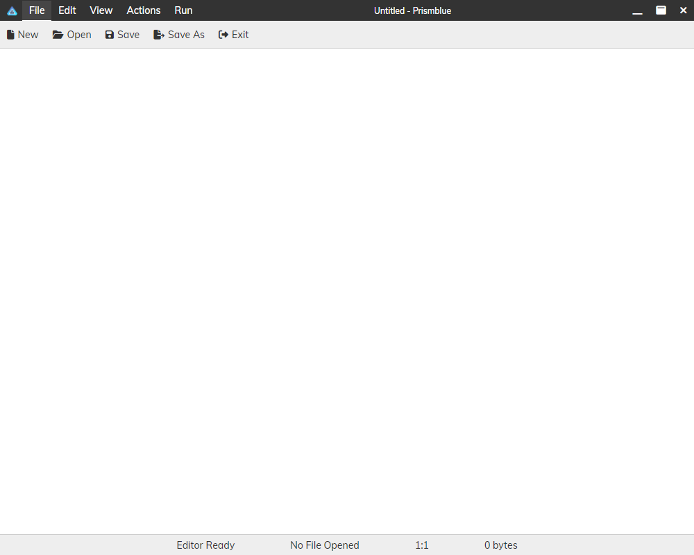

<!--
// Modules to communicate with main process
const { ipcRenderer } = require('electron')
const fs = require('fs')

// Get the DOM elements
const fileButton = document.getElementById('file-button')
const editButton = document.getElementById('edit-button')
const viewButton = document.getElementById('view-button')
const filePanel = document.getElementById('file-panel')
const editPanel = document.getElementById('edit-panel')
const viewPanel = document.getElementById('view-panel')
const openButton = document.getElementById('open-button')
const saveButton = document.getElementById('save-button')
const saveAsButton = document.getElementById('save-as-button')
const exitButton = document.getElementById('exit-button')
const copyButton = document.getElementById('copy-button')
const pasteButton = document.getElementById('paste-button')
const cutButton = document.getElementById('cut-button')
const selectAllButton = document.getElementById('select-all-button')
const findButton = document.getElementById('find-button')
const toggleThemeButton = document.getElementById('toggle-theme-button')
const fontSettingsButton = document.getElementById('font-settings-button')
const toggleStatusBarButton = document.getElementById('toggle-status-bar-button')
const editorTextarea = document.getElementById('editor-textarea')
const statusBar = document.getElementById('status-bar')
const changes = document.getElementById('changes')
const filename = document.getElementById('filename')
const rowCol = document.getElementById('row-col')
const totalSize = document.getElementById('total-size')
const findModal = document.getElementById('find-modal')
const findInput = document.getElementById('find-input')
const findNextButton = document.getElementById('find-next-button')
const findPrevButton = document.getElementById('find-prev-button')
const replaceButton = document.getElementById('replace-button')
const replaceAllButton = document.getElementById('replace-all-button')
const replaceInput = document.getElementById('replace-input')
const fontModal = document.getElementById('font-modal')
const fontSelect = document.getElementById('font-select')
const fontSizeInput = document.getElementById('font-size-input')
const applyFontButton = document.getElementById('apply-font-button')
const newButton = document.getElementById('new-button')
const historyButton = document.getElementById('history-button')
const historyPanel = document.getElementById('history-panel')
const undoButton = document.getElementById('undo-button')
const redoButton = document.getElementById('redo-button')
const restoreButton = document.getElementById('restore-button')
const restoreModal = document.getElementById('restore-modal')
const restoreAlreadyThere = document.getElementById('restore-already-there')
const failedRestore = document.getElementById('failed-restore')
const close_Button = document.getElementById('close_-button')
const minimizeButton = document.getElementById('mini-button')
const maximizeButton = document.getElementById('maxi-button')
const title = document.getElementById('title')

let maximized = false

close_Button.addEventListener('click', () => {
  ipcRenderer.send('message', 'exit')
})

minimizeButton.addEventListener('click', () => {
  ipcRenderer.send('message', 'minimize')
})

maximizeButton.addEventListener('click', () => {
  if (maximized) {
    ipcRenderer.send('message', 'unmaximize')
    maximized = false
  } else {
    ipcRenderer.send('message', 'maximize')
    maximized = true
  }
})

// Initialize the action history and redo stack
let lastSession = {}

let preferences = {
  theme: 'light',
  font: 'Courier New',
  fontSize: 16,
  statusBar: true
}

function savePreferences() {
  fs.writeFileSync('preferences.json', JSON.stringify(preferences))
}

// Variables to store the current state
let currentFilePath = null // The path of the current file
let currentFileContent = '' // The content of the current file
let currentTheme = 'light' // The current theme
let currentFont = 'Courier New' // The current font
let currentFontSize = 16 // The current font size
let currentStatusBar = true // The current status bar visibility
let currentSearchIndex = -1 // The current index of the search result
let currentSearchResults = [] // The current array of the search results

function loadPreferences() {
  try {
    preferences = JSON.parse(fs.readFileSync('preferences.json', 'utf8'))
    if (preferences.theme === 'dark') {
      toggleTheme()
    }
    currentFont = preferences.font
    currentFontSize = preferences.fontSize
    fontSelect.value = currentFont
    fontSizeInput.value = currentFontSize
    applyFont()
    if (!preferences.statusBar) {
      toggleStatusBar()
    }
  } catch (err) {
    console.log(err)
  }
}

loadPreferences()

// Add event listeners to the menu buttons
fileButton.addEventListener('click', () => {
  togglePanel(filePanel)
  // Set a custom "state" (="active") attribute on the button
  // so that we can style it differently using CSS
  fileButton.setAttribute('state', 'active')
  editButton.removeAttribute('state')
  viewButton.removeAttribute('state')
  historyButton.removeAttribute('state')
})

editButton.addEventListener('click', () => {
  togglePanel(editPanel)
  fileButton.removeAttribute('state')
  editButton.setAttribute('state', 'active')
  viewButton.removeAttribute('state')
  historyButton.removeAttribute('state')
})

viewButton.addEventListener('click', () => {
  togglePanel(viewPanel)
  fileButton.removeAttribute('state')
  editButton.removeAttribute('state')
  viewButton.setAttribute('state', 'active')
  historyButton.removeAttribute('state')
})

historyButton.addEventListener('click', () => {
  togglePanel(historyPanel)
  fileButton.removeAttribute('state')
  editButton.removeAttribute('state')
  viewButton.removeAttribute('state')
  historyButton.setAttribute('state', 'active')
})

// Add event listeners to the sub buttons
openButton.addEventListener('click', () => {
  ipcRenderer.send('message', 'open')
})

saveButton.addEventListener('click', () => {
  ipcRenderer.send('message', 'save')
})

saveAsButton.addEventListener('click', () => {
  ipcRenderer.send('message', 'save-as')
})

exitButton.addEventListener('click', () => {
  ipcRenderer.send('message', 'exit')
})

copyButton.addEventListener('click', () => {
  editorTextarea.focus()
  document.execCommand('copy')
})

pasteButton.addEventListener('click', () => {
  editorTextarea.focus()
  document.execCommand('paste')
})

cutButton.addEventListener('click', () => {
  editorTextarea.focus()
  document.execCommand('cut')
})

selectAllButton.addEventListener('click', () => {
  editorTextarea.focus()
  document.execCommand('selectAll')
})

findButton.addEventListener('click', () => {
  openModal(findModal)
})

toggleThemeButton.addEventListener('click', () => {
  toggleTheme()
})

fontSettingsButton.addEventListener('click', () => {
  openModal(fontModal)
})

toggleStatusBarButton.addEventListener('click', () => {
  toggleStatusBar()
})

// Add event listeners to the editor textarea
editorTextarea.addEventListener('input', () => {
  updateChanges()
  updateTotalSize()
})

editorTextarea.addEventListener('scroll', () => {
  highlightSearchResults()
})

editorTextarea.addEventListener('click', () => {
  updateRowCol()
})

editorTextarea.addEventListener('keyup', () => {
  updateRowCol()
})

newButton.addEventListener('click', () => {
  startBlank()
})

restoreButton.addEventListener('click', () => {
  openModal(restoreModal)
})

fileButton.click()

// Add event listeners to the modals
findModal.addEventListener('mousedown', (event) => {
  if (event.target.classList.contains('modal')) {
    // Record the initial position of the click
    findModal.initialClickX = event.clientX;
    findModal.initialClickY = event.clientY;
  }
});

findModal.addEventListener('mouseup', (event) => {
  if (
    event.target.classList.contains('modal') &&
    findModal.initialClickX === event.clientX &&
    findModal.initialClickY === event.clientY
  ) {
    closeModal(findModal);
  }
});

fontModal.addEventListener('mousedown', (event) => {
  if (event.target.classList.contains('modal')) {
    // Record the initial position of the click
    fontModal.initialClickX = event.clientX;
    fontModal.initialClickY = event.clientY;
  }
});

fontModal.addEventListener('mouseup', (event) => {
  if (
    event.target.classList.contains('modal') &&
    fontModal.initialClickX === event.clientX &&
    fontModal.initialClickY === event.clientY
  ) {
    closeModal(fontModal);
  }
});


// Add event listeners to the modal buttons
findModal.querySelector('.close-button').addEventListener('click', () => {
  closeModal(findModal)
})

findNextButton.addEventListener('click', () => {
  findNext()
})

findPrevButton.addEventListener('click', () => {
  findPrev()
})

replaceButton.addEventListener('click', () => {
  replace()
})

replaceAllButton.addEventListener('click', () => {
  replaceAll()
})

fontModal.querySelector('.close-button').addEventListener('click', () => {
  closeModal(fontModal)
})

applyFontButton.addEventListener('click', () => {
  applyFont()
})

restoreModal.querySelector('.close-button').addEventListener('click', () => {
  closeModal(restoreModal)
})

restoreModal.querySelector('#yes-restore-button').addEventListener('click', () => {
  loadHistory()
  closeModal(restoreModal)
})

restoreModal.querySelector('#no-restore-button').addEventListener('click', () => {
  closeModal(restoreModal)
})

restoreAlreadyThere.querySelector('.close-button').addEventListener('click', () => {
  closeModal(restoreAlreadyThere)
})

restoreAlreadyThere.querySelector('#ok-restore-button').addEventListener('click', () => {
  closeModal(restoreAlreadyThere)
})

failedRestore.querySelector('.close-button').addEventListener('click', () => {
  closeModal(failedRestore)
})

failedRestore.querySelector('#ok-failed-restore-button').addEventListener('click', () => {
  closeModal(failedRestore)
})

// Handle the file-opened event from the main process
ipcRenderer.on('file-opened', (event, fileName, fileContent) => {
  currentFilePath = fileName
  currentFileContent = fileContent
  editorTextarea.value = fileContent
  filename.textContent = fileName
  changes.textContent = 'File Opened'
  document.title = fileName + ' - Prismblue'
  title.textContent = fileName + ' - Prismblue'
  updateTotalSize()
  updateRowCol()
  resetSearch()
})

// Handle the file-save event from the main process
ipcRenderer.on('file-save', (event) => {
  if (currentFilePath) {
    let fileContent = editorTextarea.value
    ipcRenderer.send('file-content', currentFilePath, fileContent)
    currentFileContent = fileContent
    changes.textContent = 'File Saved'
    resetSearch()
  } else {
    ipcRenderer.send('message', 'save-as')
  }
})

// Handle the file-save-as event from the main process
ipcRenderer.on('file-save-as', (event, filePath) => {
  currentFilePath = filePath
  let fileContent = editorTextarea.value
  ipcRenderer.send('file-content', filePath, fileContent)
  currentFileContent = fileContent
  filename.textContent = filePath
  changes.textContent = 'File Ready'
  document.title = filePath + ' - Prismblue'
  title.textContent = filePath + ' - Prismblue'
  resetSearch()
})

// Toggle the visibility of a sub panel
function togglePanel(panel) {
  let panels = document.getElementsByClassName('sub-panel')
  for (let p of panels) {
    if (p === panel) {
      p.style.display = p.style.display === 'flex' ? 'none' : 'flex'
    } else {
      p.style.display = 'none'
    }
  }
}

// Update the changes status
function updateChanges() {
  let fileContent = editorTextarea.value
  if (fileContent === currentFileContent) {
    changes.textContent = 'Saved Changes'
  } else {
    changes.textContent = 'Unsaved Changes'
  }
}

// Update the total size
function updateTotalSize() {
  let fileContent = editorTextarea.value
  let fileSize = Buffer.byteLength(fileContent, 'utf8')
  totalSize.textContent = formatBytes(fileSize)
}

// Update the row and column
function updateRowCol() {
  let cursorPosition = editorTextarea.selectionStart
  let fileContent = editorTextarea.value
  let row = fileContent.substr(0, cursorPosition).split('\n').length
  let col = cursorPosition - fileContent.lastIndexOf('\n', cursorPosition - 1)
  rowCol.textContent = row + ':' + col
}

// Format bytes to human readable units
function formatBytes(bytes) {
  if (bytes === 0) return '0 bytes'
  const k = 1024
  const dm = 2
  const sizes = ['bytes', 'KB', 'MB', 'GB', 'TB', 'PB', 'EB', 'ZB', 'YB']
  const i = Math.floor(Math.log(bytes) / Math.log(k))
  return parseFloat((bytes / Math.pow(k, i)).toFixed(dm)) + ' ' + sizes[i]
}

// Open a modal
function openModal(modal) {
  modal.style.display = 'block'
}

// Close a modal
function closeModal(modal) {
  modal.style.display = 'none'
}

// Toggle the theme
function toggleTheme() {
  if (currentTheme === 'light') {
    currentTheme = 'dark'
    // For every single element in the DOM, change the theme attribute
    // to "dark" and change the toggle theme button text
    for (let element of document.querySelectorAll('*')) {
      element.setAttribute('theme', 'dark')
    }
    toggleThemeButton.innerHTML = '<i class="fas fa-adjust"></i> Toggle Theme (Dark)'
  } else {
    for (let element of document.querySelectorAll('*')) {
      element.setAttribute('theme', 'light')
    }
    toggleThemeButton.innerHTML = '<i class="fas fa-adjust"></i> Toggle Theme (Light)'
    currentTheme = 'light'
  }
  preferences.theme = currentTheme
  savePreferences()
}

// Toggle the status bar
function toggleStatusBar() {
  if (currentStatusBar) {
    currentStatusBar = false
    statusBar.style.display = 'none'
    editor.style.height = 'calc(100vh - 41px)'
    toggleStatusBarButton.innerHTML = '<i class="fas fa-info-circle"></i> Toggle Status Bar (Off)'
  } else {
    currentStatusBar = true
    statusBar.style.display = 'flex'
    editor.style.height = 'calc(100vh - 71px)'
    toggleStatusBarButton.innerHTML = '<i class="fas fa-info-circle"></i> Toggle Status Bar (On)'
  }
  preferences.statusBar = currentStatusBar
  savePreferences()
}

// Apply the font settings
function applyFont() {
  let font = fontSelect.value
  let fontSize = fontSizeInput.value
  currentFont = font
  currentFontSize = fontSize
  editorTextarea.style.fontFamily = font
  editorTextarea.style.fontSize = fontSize + 'px'
  closeModal(fontModal)
  preferences.font = currentFont
  preferences.fontSize = currentFontSize
  savePreferences()
}

// Find the next occurrence of the input text
function findNext() {
  let input = findInput.value;
  if (input) {
    if (currentSearchResults.length === 0) {
      // First time search
      let fileContent = editorTextarea.value;
      let regex = new RegExp(input, 'gi');
      let match;
      while ((match = regex.exec(fileContent)) !== null) {
        currentSearchResults.push(match.index);
      }
      currentSearchResults.sort((a, b) => a - b);
    }
    if (currentSearchResults.length > 0) {
      // Move to the next index
      currentSearchIndex = (currentSearchIndex + 1) % currentSearchResults.length;
      let index = currentSearchResults[currentSearchIndex];
      // Select the text and scroll to it
      editorTextarea.setSelectionRange(index, index + input.length);
      editorTextarea.focus(); // Added focus to ensure highlighting works
      editorTextarea.scrollTop = editorTextarea.scrollHeight * (index / editorTextarea.value.length);
      // Highlight the search results
      highlightSearchResults();
    }
  }
}

// Find the previous occurrence of the input text
function findPrev() {
  let input = findInput.value;
  if (input) {
    if (currentSearchResults.length === 0) {
      // First time search
      let fileContent = editorTextarea.value;
      let regex = new RegExp(input, 'gi');
      let match;
      while ((match = regex.exec(fileContent)) !== null) {
        currentSearchResults.push(match.index);
      }
      currentSearchResults.sort((a, b) => a - b);
    }
    if (currentSearchResults.length > 0) {
      // Move to the previous index
      currentSearchIndex = (currentSearchIndex - 1 + currentSearchResults.length) % currentSearchResults.length;
      let index = currentSearchResults[currentSearchIndex];
      // Select the text and scroll to it
      editorTextarea.setSelectionRange(index, index + input.length);
      editorTextarea.focus(); // Added focus to ensure highlighting works
      editorTextarea.scrollTop = editorTextarea.scrollHeight * (index / editorTextarea.value.length);
      // Highlight the search results
      highlightSearchResults();
    }
  }
}

// Replace the current occurrence of the input text with the replace text
function replace() {
  let input = findInput.value;
  let replaceText = replaceInput.value;
  if (input) {
    if (currentSearchResults.length > 0 && currentSearchIndex >= 0) {
      // Get the current index and the file content
      let index = currentSearchResults[currentSearchIndex];
      let fileContent = editorTextarea.value;
      // Replace the input text with the replace text
      fileContent = fileContent.slice(0, index) + replaceText + fileContent.slice(index + input.length);
      editorTextarea.value = fileContent;
      // Update the current file content and the changes status
      currentFileContent = fileContent;
      updateChanges();
      // Reset the search results and the search index
      resetSearch();
    }
  }
}

// Replace all the occurrences of the input text with the replace text
// HOLY **** ALL THIS TIME THERE WAS A REPLACEALL IN JS?!!
function replaceAll() {
  let input = findInput.value;
  let replaceText = replaceInput.value;
  if (input) {
    // Get the file content
    let fileContent = editorTextarea.value;
    // Replace all the input text with the replace text
    fileContent = fileContent.replaceAll(input, replaceText); // Use replaceAll method
    editorTextarea.value = fileContent;
    // Update the current file content and the changes status
    currentFileContent = fileContent;
    updateChanges();
    // Reset the search results and the search index
    resetSearch();
  }
}


// Reset the search results and the search index
function resetSearch() {
  currentSearchResults = []
  currentSearchIndex = -1
  highlightSearchResults()
}

// Highlight the search results in the editor textarea
function highlightSearchResults() {
  let input = findInput.value
  if (input) {
    // Create a canvas element to draw the highlights
    let canvas = document.createElement('canvas')
    let ctx = canvas.getContext('2d')
    // Get the editor textarea dimensions and styles
    let width = editorTextarea.clientWidth
    let height = editorTextarea.clientHeight
    let lineHeight = parseInt(getComputedStyle(editorTextarea).lineHeight)
    let fontSize = parseInt(getComputedStyle(editorTextarea).fontSize)
    let fontFamily = getComputedStyle(editorTextarea).fontFamily
    let padding = parseInt(getComputedStyle(editorTextarea).padding)
    // Set the canvas dimensions and styles
    canvas.width = width
    canvas.height = height
    ctx.fillStyle = 'rgba(255, 255, 0, 0.5)'
    ctx.font = fontSize + 'px ' + fontFamily
    // Get the editor textarea content and scroll position
    let fileContent = editorTextarea.value
    let scrollTop = editorTextarea.scrollTop
    // Loop through the search results and draw a rectangle for each one
    for (let index of currentSearchResults) {
      // Get the row and column of the index
      let row = fileContent.substr(0, index).split('\n').length
      let col = index - fileContent.lastIndexOf('\n', index - 1)
      // Get the x and y coordinates of the rectangle
      let x = ctx.measureText(fileContent.split('\n')[row - 1].slice(0, col)).width + padding
      let y = (row - 1) * lineHeight + padding - scrollTop
      // Get the width and height of the rectangle
      let w = ctx.measureText(input).width
      let h = lineHeight
      // Draw the rectangle
      ctx.fillRect(x, y, w, h)
    }
    // Set the background image of the editor textarea to the canvas
    editorTextarea.style.backgroundImage = 'url(' + canvas.toDataURL() + ')'
  } else {
    // Clear the background image of the editor textarea
    editorTextarea.style.backgroundImage = 'none'
  }
}

document.addEventListener('keydown', (event) => {

  if (event.ctrlKey && event.code === 'KeyS') {
    if (event.shiftKey) {
      console.log('Save As');
      ipcRenderer.send('message', 'save-as');
    } else {
      console.log('Save');
      ipcRenderer.send('message', 'save');
    }
    event.preventDefault();
  }
});


function startBlank() {
  currentFilePath = null
  currentFileContent = ''
  editorTextarea.value = ''
  filename.textContent = 'Untitled'
  changes.textContent = 'New File'
  updateTotalSize()
  updateRowCol()
  resetSearch()
  document.title = 'Untitled - Prismblue'
  title.textContent = 'Untitled - Prismblue'
}

// Function to add the current state to the action history
function addToHistory() {
  // If the current state is the same as the last state, then don't add it to the history
  lastSession = {
    content: editorTextarea.value,
    selectionStart: editorTextarea.selectionStart,
    selectionEnd: editorTextarea.selectionEnd,
    filePath: currentFilePath
  }

  if (lastSession.content === currentFileContent) {
    return
  }

  if (lastSession.filePath === null || lastSession.filePath === undefined || lastSession.filePath === '') {
    lastSession.filePath = 'Untitled'
  }

  // Save that to "session.json"
  fs.writeFileSync('session.json', JSON.stringify(lastSession))
}

function loadHistory(){
  let lastSession = {}
  try {
    // Load the last session from "session.json"
    lastSession = JSON.parse(fs.readFileSync('session.json', 'utf8'))
  } catch (err) {
    console.log(err)
    openModal(failedRestore)
    return;
  }

  // If the last session is the same as the current session, then don't load it
  if (lastSession.content === editorTextarea.value) {
    openModal(restoreAlreadyThere)
    return
  }

  try {
      // If the last session is not null, then load it
      if (lastSession) {
        currentFilePath = lastSession.filePath
        currentFileContent = lastSession.content
        editorTextarea.value = lastSession.content
        filename.textContent = lastSession.filePath
        changes.textContent = 'File Opened'
        updateTotalSize()
        updateRowCol()
        resetSearch()
      } else {
        console.log('No last session found')
      }
  } catch (err) {
    console.log(err)
    openModal(failedRestore)
    return;
  }
}

// Whenever the value of the editor textarea changes, add the current state to the action history
editorTextarea.addEventListener('keyup', addToHistory);

function undo() {
  document.execCommand('undo');
}

function redo() {
  document.execCommand('redo');
}

// Handle the undo button click event
undoButton.addEventListener('click', undo);

// Handle the redo button click event
redoButton.addEventListener('click', redo);
-->


# Prismblue

Welcome to the Prismblue repository! It's a simple text editor with a neat UI and some cool features which doesn't consume much!

## Features

The Prismblue text editor offers the following features:

- Open, save, and save as files in any format
- A visual solution to editing your text
- Customizable editor look and feel
- Review the status of your file in one place
- Possibility to restore an automatically created backup of your file

## Installation

## Classic (Windows)

This installation method is for Windows users who want to install Prismblue as a typical desktop application (portable installation).

1. Download the latest release from the [Releases](https://github.com/LyubomirT/prismblue/releases) page. For each release there are files for Windows, macOS, and Linux. Download the file for Windows that matches your system architecture (32-bit or 64-bit).
2. Extract the downloaded zip file.
3. Run the `Prismblue.exe` file.
4. You're done! Now Prismblue should be running and you should see the main window.

## Git (Windows, macOS, Linux)

If you don't want to download a release, you can clone the repository and run Prismblue from the source code (or build it yourself).

1. Install [Git](https://git-scm.com/downloads) for your operating system (should generall be available for most operating systems on most architectures).
2. Clone the repository by running the following command in your terminal:

```bash
git clone https://github.com/LyubomirT/prismblue.git
```

3. Change the directory to the cloned repository:

```bash
cd prismblue
```

4. Install the dependencies:

```bash
npm install
```

5. Run Prismblue:

```bash
npm run start
```

6. Prismblue is running and if everything went well, you should see the main window.

## Using Prismblue

Prismblue itself is pretty simple to use and is very intuitive. However, some of the features might not be so obvious, so here's a quick guide on how to use them.

### The Interface



On the image above you can see the Prismblue interface. It consists of the following parts:

- The titlebar
- The menu (or submenu) buttons
- The editor
- The status bar

#### The Titlebar

The titlebar is the topmost part of the interface. On the very left you can see the logo of Prismblue. Then comes the menu buttons, such as "File", "Edit", etc. In the middle there is the title of the current file. At the right there are the minimize, maximize, and close buttons.

#### Submenu Buttons

This widget contains the buttons for the menus. For example, when you click on the "File" button, the submenu buttons will show the buttons for the "File" menu ("New", "Open", etc.). Clicking on the currently active menu button will hide the submenu buttons and leave the widget empty.

#### The Editor

The editor is the main part of the interface. There you can edit or view your text. It's scrollable and is pretty much infinite in size (as long as your RAM can handle it).

#### The Status Bar

The status bar is the bottommost part of the interface. It contains information about the current file, such as the filename, the changes status, the row and column, and the total size of the file.

### Customizing the Editor

Prismblue offers quite a few options for customizing the editor. For example, you can change the theme, the font, the font size, and the status bar visibility. To see all your options, click on the "View" button in the menu.

> [!IMPORTANT]
> All your preferences will be **automatically saved** and will be loaded the next time you open Prismblue.

### Opening and Saving Files

To open a file, click on the "File" button in the menu and then click on the "Open" button in the submenu. Then select the file you want to open. Prismblue supports all file formats... but anything that's encoded will most likely look like gibberish.

To save a file, click on the "File" button in the menu and then click on the "Save" button in the submenu. If you haven't opened a file yet, then Prismblue will ask you to select a file to save to. "Save As" is the same as "Save", but it will always ask you to select a file to save to, creating a new file (or overwriting an existing one) in the process.

>[!TIP]
> You can also use the keyboard shortcuts for saving files. To save a file, press `Ctrl+S`. To save a file as, press `Ctrl+Shift+S`.

### The Action History

Prismblue has an action history, which allows you to undo and redo your actions. To see the action history, click on the "History" button in the menu. Then you can click on the "Undo" and "Redo" buttons to undo and redo your actions respectively.

### Restoring a File

Let's say you accidentally closed Prismblue and you didn't save your file. Prismblue automatically creates a backup of your file any time you change something. To restore your file, click on the "History" button in the menu and then click on the "Restore" button in the submenu. Then click on the "Yes" button in the modal that appears. Your file should be restored.

> [!CAUTION]
> If you interact with Prismblue in any way after you close it, then the backup will be lost and you won't be able to restore your file.

### Finding and Replacing Text

This text editor allows you to find text in your file and jump to it or replace it. If you want to find something, simply click on the "Edit" button in the menu and then click on the "Find" button in the submenu. In the modal that appears, enter the text you want to find and then click on the "Find Next" button to jump to the next occurrence of the text or click on the "Find Previous" button to jump to the previous occurrence of the text. You can also replace the current occurrence of the text by entering the text you want to replace it with and then clicking on the "Replace" button. To not bother yourself spamming the "Replace" button, you can replace all the occurrences of the text by clicking on the "Replace All" button.

### Copying, Pasting, and Cutting Text

Most likely you won't ever need to use these buttons, but in the "Edit" menu you can find the "Copy", "Paste", and "Cut" buttons. They work just like the keyboard shortcuts for copying, pasting, and cutting text.

(In case you don't know, the keyboard shortcuts for copying, pasting, and cutting text are `Ctrl+C`, `Ctrl+V`, and `Ctrl+X` respectively.)

### Selecting All Text

Same as the previous section, this button is probably useless. In the "Edit" menu you can find the "Select All" button. It works just like the keyboard shortcut for selecting all text (`Ctrl+A`).

### The Status Bar

The status bar below (which is hide-able, by the way) contains some information describing the current state of the file you're working on. It contains the filename, the changes status, the row and column, and the total size of the file.

